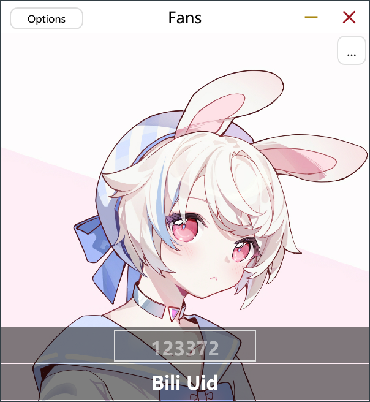

# Fans-vst

* A VST3 plugin for showing your Bilibili’s name and fans.  
* Made with JUCE.  
* Provide VST3 plugin, Audio unit and standalone application.  
* Support Windows(x64) and MacOS(Universe).  

## Installation

Download the released package.  
And copy file to  
Windows:  
--VST3:C:\Program Files\Common Files\VST3  
MacOS:  
--VST3:/Library/Audio/Plug-Ins/VST3  
--AU:/Library/Audio/Plug-Ins/Components  

## Usage
Load the plugin on your DAW or run the standalone app.  
Setting the Uid by click the button in the top right corner or press Return.  

## Screenshots
VST3:  

AU:  

Standalone:  

## License
[GPL](https://choosealicense.com/licenses/gpl-3.0/)
